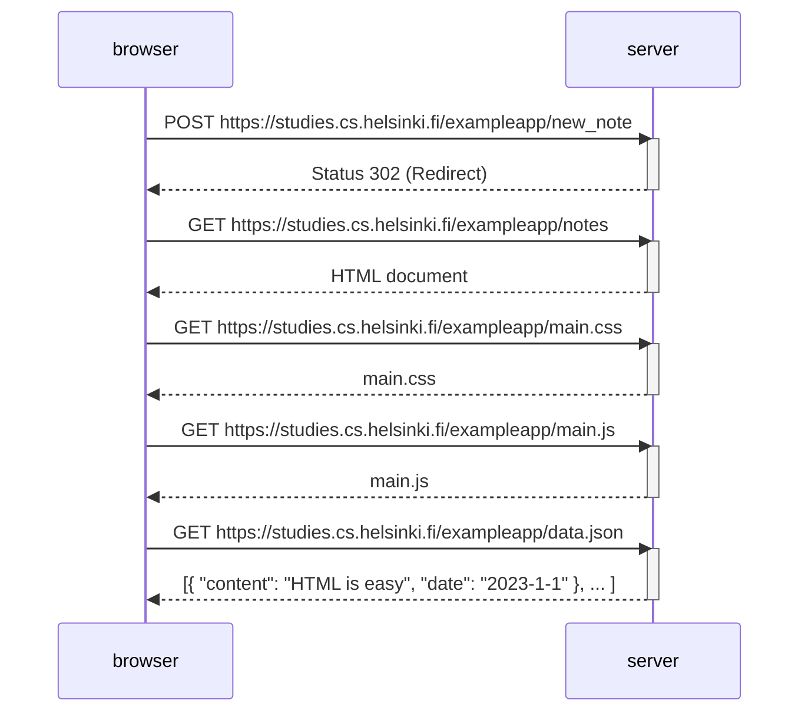
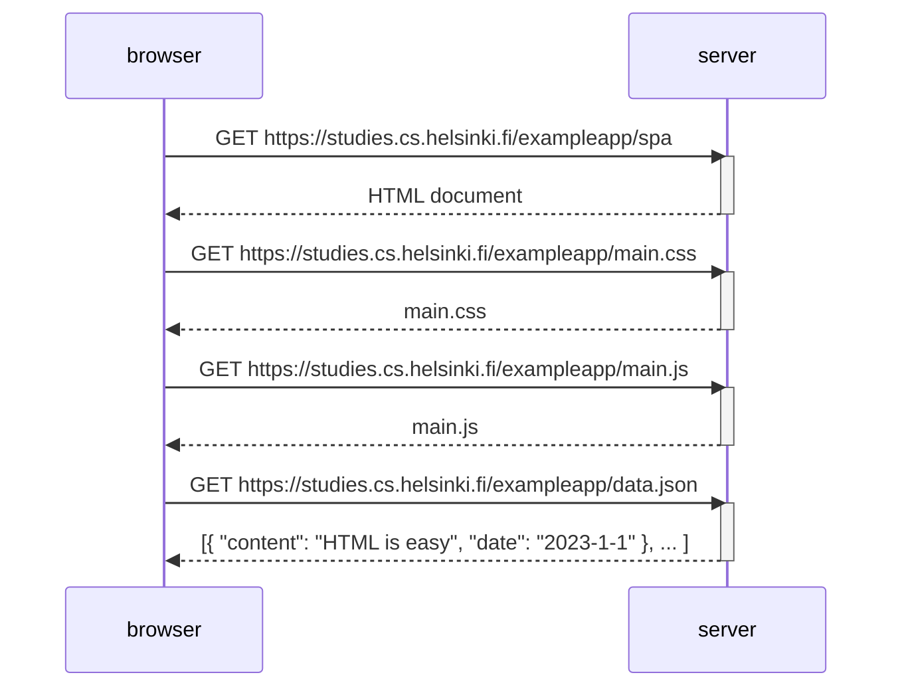
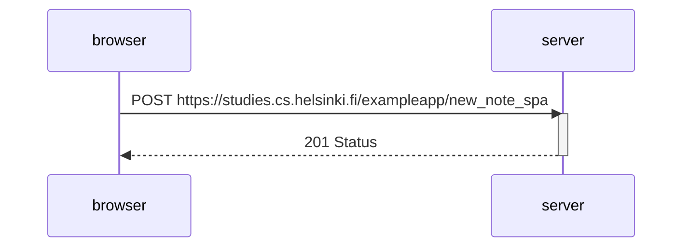

# Full Stack Open

## Part 0 - Fundamentals of Web Apps

Open chrome developer tools with `option-cmd-i`  
Traditional web app builds the HTML on the server and returns it to the client  
Single page app has a single html page returned from server that is manipulated by javascript

0.4: Traditional web app handles form submission

0.5: SPA loads resources

0.6: SPA handles form submission

## Part 1 - Introduction to React

Vite is a build tool (like webpack) to provide a faster web development experience
JSX is returned from React components and it is compiled to JavaScript (this compilation is handled by Babel)
Edit eslintrc.cjs to silence/add ESLint warnings

ECMAScript: the JavaScript standard so that web pages work across multiple browsers
NodeJS: JavaScript runtime engine so that js can be run anywhere
concat(x) returns array with new item (x) added to it
Use destructuring to assign values of obj/arr to variables
